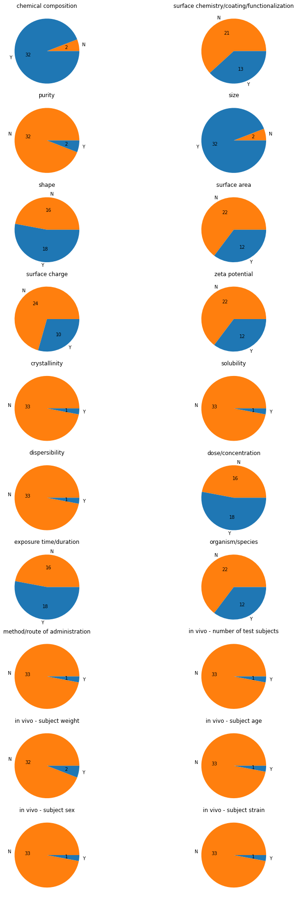

# Data completeness and reusability assessment for 34 nanosafety datasets

Based on previous work of Irini Furxhi [https://doi.org/10.1016/j.impact.2021.100378](https://doi.org/10.1016/j.impact.2021.100378), a FAIR-based analysis for reusability has bee conducted on 3d datasets from the nanosafety domain.

First, each dataset was described with an HTML page showing the main metadata about the original publication and a glimpse of the related datasets content.
In parallel, each dataset overview page was annotated with nanosafety-community FAIR maturity indicators for reusability using the NSDRA framewrok JSON-LD metadata generator [http://w3id.org/nsdra/metadata-generator](http://w3id.org/nsdra/metadata-generator).
Next, the JSON-LD was extracted and analyzed to get insight about the varaibles measured/reported in each dataset and the suitable applications for reusability.

The construction of the dataset description, overview pages and the analysis has been performed using Python and Jupyter notebook. 
Link to the analysis notebook: [Analysis Jupyter Notebook](notebook.ipynb)

Below is the general description of the 34 publications. Each row is linked to the detailed overview of the related dataset.

## Dataset publications description

Details 							|group_key                        |DOI                              |hash                            |title                                                                                                                                                                                                                         |journal                                                               |dateOfPublish-year|dateOfPublish-month|dateOfPublish-day|authors                                                                                                                                                                                                                                |link                                                                        |license                                                                                                                |subject                                                                                                                                                                               |type           |
------------------------------------|---------------------------------|---------------------------------|--------------------------------|------------------------------------------------------------------------------------------------------------------------------------------------------------------------------------------------------------------------------|----------------------------------------------------------------------|------------------|-------------------|-----------------|---------------------------------------------------------------------------------------------------------------------------------------------------------------------------------------------------------------------------------------|----------------------------------------------------------------------------|-----------------------------------------------------------------------------------------------------------------------|--------------------------------------------------------------------------------------------------------------------------------------------------------------------------------------|---------------|
[details](overview/9e1d426c90.md)	|Toxicological Datasets           |10.1073/pnas.1919755117          |9e1d426c9015fc15d718b0fbd3f41152|Machine learning predicts the functional composition of the protein corona and the cellular recognition of nanoparticles                                                                                                      |Proceedings of the National Academy of Sciences                       |2020              |4                  |24               |Zhan Ban, Peng Yuan, Fubo Yu, Ting Peng, Qixing Zhou, Xiangang Hu                                                                                                                                                                      |                                                                            |https://creativecommons.org/licenses/by-nc-nd/4.0/                                                                     |Multidisciplinary                                                                                                                                                                     |journal-article|
[details](overview/9a9ad3fe96.md)	|Toxicological Datasets           |10.1289/ehp6508                  |9a9ad3fe96432ca53a6ad331a5283ea6|Quantitative Structure–Activity Relationship Models for Predicting Inflammatory Potential of Metal Oxide Nanoparticles                                                                                                        |Environmental Health Perspectives                                     |2020              |6                  |                 |Yang Huang, Xuehua Li, Shujuan Xu, Huizhen Zheng, Lili Zhang, Jingwen Chen, Huixiao Hong, Rebecca Kusko, Ruibin Li                                                                                                                     |                                                                            |https://ehp.niehs.nih.gov/about-ehp/license                                                                            |Health, Toxicology and Mutagenesis,Public Health, Environmental and Occupational Health                                                                                               |journal-article|
[details](overview/1687649488.md)	|Toxicological Datasets           |10.1038/s41598-018-24483-z       |16876494884cd452d29ad6455ab7e4dc|Towards a generalized toxicity prediction model for oxide nanomaterials using integrated data from different sources                                                                                                          |Scientific Reports                                                    |2018              |4                  |17               |Jang-Sik Choi, My Kieu Ha, Tung Xuan Trinh, Tae Hyun Yoon, Hyung-Gi Byun                                                                                                                                                               |http://www.nature.com/articles/s41598-018-24483-z.pdf                       |https://creativecommons.org/licenses/by/4.0                                                                            |Multidisciplinary                                                                                                                                                                     |journal-article|
[details](overview/5d2e680699.md)	|Toxicological Datasets           |10.3390/nano10102017             |5d2e680699dcb1d8ec6ee07941653774|Predicting Cytotoxicity of Metal Oxide Nanoparticles Using Isalos Analytics Platform                                                                                                                                          |Nanomaterials                                                         |2020              |10                 |13               |Anastasios G. Papadiamantis, Jaak Jänes, Evangelos Voyiatzis, Lauri Sikk, Jaanus Burk, Peeter Burk, Andreas Tsoumanis, My Kieu Ha, Tae Hyun Yoon, Eugenia Valsami-Jones, Iseult Lynch, Georgia Melagraki, Kaido Tämm, Antreas Afantitis|                                                                            |https://creativecommons.org/licenses/by/4.0/                                                                           |General Materials Science,General Chemical Engineering                                                                                                                                |journal-article|
[details](overview/0a77bd4afd.md)	|Toxicological Datasets           |10.1002/smll.201900510           |0a77bd4afd69252e1fa0b8f3e52c1100|Bayesian Network Resource for Meta‐Analysis: Cellular Toxicity of Quantum Dots                                                                                                                                                |Small                                                                 |2019              |6                  |17               |Muhammad Bilal, Eunkeu Oh, Rong Liu, Joyce C. Breger, Igor L. Medintz, Yoram Cohen                                                                                                                                                     |https://api.wiley.com/onlinelibrary/tdm/v1/articles/10.1002%2Fsmll.201900510|http://onlinelibrary.wiley.com/termsAndConditions#am                                                                   |Biomaterials,Biotechnology,General Materials Science,General Chemistry                                                                                                                |journal-article|
[details](overview/51cbf2d4ae.md)	|Toxicological Datasets           |10.1021/acs.est.8b02757          |51cbf2d4aebab163496fe926091be171|Screening Priority Factors Determining and Predicting the Reproductive Toxicity of Various Nanoparticles                                                                                                                      |Environmental Science &amp; Technology                                |2018              |7                  |30               |Zhan Ban, Qixing Zhou, Anqi Sun, Li Mu, Xiangang Hu                                                                                                                                                                                    |                                                                            |https://creativecommons.org/licenses/by-nc/4.0/                                                                        |Environmental Chemistry,General Chemistry                                                                                                                                             |journal-article|
[details](overview/4f4d02f185.md)	|Toxicological Datasets           |10.1080/17435390.2019.1595206    |4f4d02f185841bd3bf33503d672fd16c|Application of Bayesian networks in determining nanoparticle-induced cellular outcomes using transcriptomics                                                                                                                  |Nanotoxicology                                                        |2019              |5                  |29               |Irini Furxhi, Finbarr Murphy, Craig A. Poland, Barry Sheehan, Martin Mullins, Paride Mantecca                                                                                                                                          |https://tandfonline.com/doi/pdf/10.1080/17435390.2019.1595206               |http://creativecommons.org/licenses/by-nc-nd/4.0/                                                                      |Toxicology,Biomedical Engineering                                                                                                                                                     |journal-article|
[details](overview/0e3c23628a.md)	|Toxicological Datasets           |10.1016/j.chemosphere.2018.11.014|0e3c23628a103c9cf92cc651a30ccc4a|Quasi-QSAR for predicting the cell viability of human lung and skin cells exposed to different metal oxide nanomaterials                                                                                                      |Chemosphere                                                           |2019              |2                  |                 |Jang-Sik Choi, Tung X. Trinh, Tae-Hyun Yoon, Jongwoon Kim, Hyung-Gi Byun                                                                                                                                                               |                                                                            |https://www.elsevier.com/tdm/userlicense/1.0/                                                                          |General Medicine,General Chemistry,Environmental Chemistry,Environmental Engineering,Pollution,Health, Toxicology and Mutagenesis,Public Health, Environmental and Occupational Health|journal-article|
[details](overview/ff9cfd6e9e.md)	|Toxicological Datasets           |10.1038/s41467-020-16413-3       |ff9cfd6e9e9373c0f4196ff2b093d57c|Construction of a web-based nanomaterial database by big data curation and modeling friendly nanostructure annotations                                                                                                        |Nature Communications                                                 |2020              |5                  |20               |Xiliang Yan, Alexander Sedykh, Wenyi Wang, Bing Yan, Hao Zhu                                                                                                                                                                           |http://www.nature.com/articles/s41467-020-16413-3.pdf                       |https://creativecommons.org/licenses/by/4.0                                                                            |General Physics and Astronomy,General Biochemistry, Genetics and Molecular Biology,General Chemistry                                                                                  |journal-article|
[details](overview/30f8d0f755.md)	|Toxicological Datasets           |10.4018/ijqspr.20201001.oa2      |30f8d0f7550dd28cfe6e145aa29da619|Development of Generalized QSAR Models for Predicting Cytotoxicity and Genotoxicity of Metal Oxides Nanoparticles                                                                                                             |International Journal of Quantitative Structure-Property Relationships|2020              |10                 |1                |Pravin Ambure, Arantxa Ballesteros, Francisco Huertas, Pau Camilleri, Stephen J. Barigye, Rafael Gozalbes                                                                                                                              |                                                                            |http://creativecommons.org/licenses/by/3.0/deed.en_US                                                                  |Geriatrics and Gerontology                                                                                                                                                            |journal-article|
[details](overview/dd7e97719a.md)	|Toxicological Datasets           |10.3390/ijms21155280             |dd7e97719a7a4d561f8dbefc27b73390|Predicting In Vitro Neurotoxicity Induced by Nanoparticles Using Machine Learning                                                                                                                                             |International Journal of Molecular Sciences                           |2020              |7                  |25               |Irini Furxhi, Finbarr Murphy                                                                                                                                                                                                           |                                                                            |https://creativecommons.org/licenses/by/4.0/                                                                           |Inorganic Chemistry,Organic Chemistry,Physical and Theoretical Chemistry,Computer Science Applications,Spectroscopy,Molecular Biology,General Medicine,Catalysis                      |journal-article|
[details](overview/40a0d72701.md)	|Toxicological Datasets           |10.1007/s11224-021-01869-w       |40a0d72701e9766b96b10a4c30fec4cd|Using the Isalos platform to develop a (Q)SAR model that predicts metal oxide toxicity utilizing facet-based electronic, image analysis-based, and periodic table derived properties as descriptors                           |Structural Chemistry                                                  |2021              |12                 |23               |M. M. Thwala, A. Afantitis, A. G. Papadiamantis, A. Tsoumanis, G. Melagraki, L. N. Dlamini, C. N. M. Ouma, P. Ramasami, R. Harris, T. Puzyn, N. Sanabria, I. Lynch, M. Gulumian                                                        |https://link.springer.com/content/pdf/10.1007/s11224-021-01869-w.pdf        |https://creativecommons.org/licenses/by/4.0                                                                            |Physical and Theoretical Chemistry,Condensed Matter Physics                                                                                                                           |journal-article|
[details](overview/2210ee6fb3.md)	|Toxicological Datasets           |10.1039/d0en01240h               |2210ee6fb32877791d97ba4adb4faed3|Cytotoxicity analysis of nanoparticles by association rule mining                                                                                                                                                             |Environmental Science: Nano                                           |2021              |                   |                 |Gulsah Gul, Ramazan Yildirim, Nazar Ileri-Ercan                                                                                                                                                                                        |                                                                            |http://rsc.li/journals-terms-of-use                                                                                    |General Environmental Science,Materials Science (miscellaneous)                                                                                                                       |journal-article|
[details](overview/852ace6f62.md)	|Toxicological Datasets           |10.1021/acs.chemrestox.7b00303   |852ace6f6288f335dbbdfc0f149d679e|Quasi-SMILES-Based Nano-Quantitative Structure–Activity Relationship Model to Predict the Cytotoxicity of Multiwalled Carbon Nanotubes to Human Lung Cells                                                                    |Chemical Research in Toxicology                                       |2018              |2                  |14               |Tung Xuan Trinh, Jang-Sik Choi, Hyunpyo Jeon, Hyung-Gi Byun, Tae-Hyun Yoon, Jongwoon Kim                                                                                                                                               |                                                                            |https://creativecommons.org/licenses/by-nc/4.0/                                                                        |Toxicology,General Medicine                                                                                                                                                           |journal-article|
[details](overview/364572eee5.md)	|Toxicological Datasets           |10.1080/17435390.2016.1278481    |364572eee5b81bf59ff7ae8fc095ccfb|Application of Bayesian networks for hazard ranking of nanomaterials to support human health risk assessment                                                                                                                  |Nanotoxicology                                                        |2017              |1                  |2                |Hans J. P. Marvin, Yamine Bouzembrak, Esmée M. Janssen, Meike van der Zande, Finbarr Murphy, Barry Sheehan, Martin Mullins, Hans Bouwmeester                                                                                           |https://www.tandfonline.com/doi/pdf/10.1080/17435390.2016.1278481           |http://creativecommons.org/licenses/by-nc-nd/4.0/                                                                      |Toxicology,Biomedical Engineering                                                                                                                                                     |journal-article|
[details](overview/0904205a9a.md)	|Toxicological Datasets           |10.3762/bjnano.6.192             |0904205a9a7d59d1274b61d2c83f97c4|Predicting cytotoxicity of PAMAM dendrimers using molecular descriptors                                                                                                                                                       |Beilstein Journal of Nanotechnology                                   |2015              |9                  |11               |David E Jones, Hamidreza Ghandehari, Julio C Facelli                                                                                                                                                                                   |                                                                            |http://creativecommons.org/licenses/by/2.0                                                                             |Electrical and Electronic Engineering,General Physics and Astronomy,General Materials Science                                                                                         |journal-article|
[details](overview/a1cc8d0161.md)	|Toxicological Datasets           |10.1016/j.impact.2021.100298     |a1cc8d01610f24dc3ca54c053134d707|Use of size-dependent electron configuration fingerprint to develop general prediction models for nanomaterials                                                                                                               |NanoImpact                                                            |2021              |1                  |                 |Hyun Kil Shin, Soojin Kim, Seokjoo Yoon                                                                                                                                                                                                |                                                                            |https://www.elsevier.com/tdm/userlicense/1.0/                                                                          |Public Health, Environmental and Occupational Health,Safety Research,Safety, Risk, Reliability and Quality,Materials Science (miscellaneous)                                          |journal-article|
[details](overview/1e7da9d774.md)	|Toxicological Datasets           |10.1111/risa.12109               |1e7da9d774c38851a23f5b0ec66b5aff|A Meta-Analysis of Carbon Nanotube Pulmonary Toxicity Studies-How Physical Dimensions and Impurities Affect the Toxicity of Carbon Nanotubes                                                                                  |Risk Analysis                                                         |2013              |9                  |11               |Jeremy M. Gernand, Elizabeth A. Casman                                                                                                                                                                                                 |                                                                            |http://doi.wiley.com/10.1002/tdm_license_1.1                                                                           |Physiology (medical),Safety, Risk, Reliability and Quality                                                                                                                            |journal-article|
[details](overview/4ab8fc4886.md)	|Toxicological Datasets           |10.1021/nn406018q                |4ab8fc4886992f27977aa1161de85c00|Protein Corona Fingerprinting Predicts the Cellular Interaction of Gold and Silver Nanoparticles                                                                                                                              |ACS Nano                                                              |2014              |2                  |25               |Carl D. Walkey, Jonathan B. Olsen, Fayi Song, Rong Liu, Hongbo Guo, D. Wesley H. Olsen, Yoram Cohen, Andrew Emili, Warren C. W. Chan                                                                                                   |                                                                            |https://creativecommons.org/licenses/by-nc/4.0/                                                                        |General Physics and Astronomy,General Engineering,General Materials Science                                                                                                           |journal-article|
[details](overview/409b3f244f.md)	|Toxicological Datasets           |10.1021/acsnano.8b07562          |409b3f244f83b2bfe21a1bccd586a221|Meta-Analysis of Nanoparticle Cytotoxicity via Data-Mining the Literature                                                                                                                                                     |ACS Nano                                                              |2019              |1                  |31               |Hagar I. Labouta, Nasimeh Asgarian, Kristina Rinker, David T. Cramb                                                                                                                                                                    |                                                                            |https://doi.org/10.15223/policy-029                                                                                    |General Physics and Astronomy,General Engineering,General Materials Science                                                                                                           |journal-article|
[details](overview/0dbe3fd7cd.md)	|Perturbation Datasets            |10.1016/j.chemosphere.2019.125489|0dbe3fd7cd021f444d98c55132f48473|A unified in silico model based on perturbation theory for assessing the genotoxicity of metal oxide nanoparticles                                                                                                            |Chemosphere                                                           |2020              |4                  |                 |Amit Kumar Halder, André Melo, M. Natália D.S. Cordeiro                                                                                                                                                                                |                                                                            |https://www.elsevier.com/tdm/userlicense/1.0/                                                                          |General Medicine,General Chemistry,Environmental Chemistry,Environmental Engineering,Pollution,Health, Toxicology and Mutagenesis,Public Health, Environmental and Occupational Health|journal-article|
[details](overview/d97c408142.md)	|Perturbation Datasets            |10.1016/j.envint.2014.08.009     |d97c408142f8a2badc39d857367e65a8|Computational ecotoxicology: Simultaneous prediction of ecotoxic effects of nanoparticles under different experimental conditions                                                                                             |Environment International                                             |2014              |12                 |                 |Valeria V. Kleandrova, Feng Luan, Humberto González-Díaz, Juan M. Ruso, André Melo, Alejandro Speck-Planche, M. Natália D.S. Cordeiro                                                                                                  |                                                                            |https://www.elsevier.com/tdm/userlicense/1.0/                                                                          |General Environmental Science                                                                                                                                                         |journal-article|
[details](overview/d220a31dfb.md)	|Perturbation Datasets            |10.1080/17435390.2017.1379567    |d220a31dfbd928c6818d49a713ca2fff|Probing the toxicity of nanoparticles: a unified <i>in silico</i> machine learning model based on perturbation theory                                                                                                         |Nanotoxicology                                                        |2017              |8                  |9                |Riccardo Concu, Valeria V. Kleandrova, Alejandro Speck-Planche, M. Natália D. S. Cordeiro                                                                                                                                              |                                                                            |https://creativecommons.org/licenses/by-nc/4.0/                                                                        |Toxicology,Biomedical Engineering                                                                                                                                                     |journal-article|
[details](overview/526962eb58.md)	|Perturbation Datasets            |10.1039/c4nr01285b               |526962eb58312803b6868a4fa5e96c22|Computer-aided nanotoxicology: assessing cytotoxicity of nanoparticles under diverse experimental conditions by using a novel QSTR-perturbation approach                                                                      |Nanoscale                                                             |2014              |6                  |25               |Feng Luan, Valeria V. Kleandrova, Humberto González-Díaz, Juan M. Ruso, André Melo, Alejandro Speck-Planche, M. Natália D. S. Cordeiro                                                                                                 |                                                                            |https://www.rsc.org/journals-books-databases/author-and-reviewer-hub/authors-information/licences-copyright-permissions|General Materials Science                                                                                                                                                             |journal-article|
[details](overview/ef846b8f8b.md)	|Perturbation Datasets            |10.1021/es503861x                |ef846b8f8be6523ae1f4fdf8e440cd11|Computational Tool for Risk Assessment of Nanomaterials: Novel QSTR-Perturbation Model for Simultaneous Prediction of Ecotoxicity and Cytotoxicity of Uncoated and Coated Nanoparticles under Multiple Experimental Conditions|Environmental Science &amp; Technology                                |2014              |11                 |21               |Valeria V. Kleandrova, Feng Luan, Humberto González-Díaz, Juan M. Ruso, Alejandro Speck-Planche, M. Natália D. S. Cordeiro                                                                                                             |                                                                            |https://creativecommons.org/licenses/by-nc/4.0/                                                                        |Environmental Chemistry,General Chemistry                                                                                                                                             |journal-article|
[details](overview/84a9f57ee6.md)	|PhysChem & Functionality Datasets|10.1080/15363830701779315        |84a9f57ee628617787b9ebab1aa5d2f7|A Molecular-Based Model for Prediction of Solubility of C60 Fullerene in Various Solvents                                                                                                                                     |Fullerenes, Nanotubes and Carbon Nanostructures                       |2008              |1                  |                 |Farhad Gharagheizi, Reza Fareghi Alamdari                                                                                                                                                                                              |                                                                            |https://creativecommons.org/licenses/by/4.0/                                                                           |Organic Chemistry,Physical and Theoretical Chemistry,General Materials Science,Atomic and Molecular Physics, and Optics                                                               |journal-article|
[details](overview/909758f06b.md)	|PhysChem & Functionality Datasets|10.1016/j.impact.2021.100308     |909758f06b965ff79e92f1c45e0c4e1a|Computational enrichment of physicochemical data for the development of a zeta-potential read-across predictive model with Isalos Analytics Platform                                                                          |NanoImpact                                                            |2021              |4                  |                 |Anastasios G. Papadiamantis, Antreas Afantitis, Andreas Tsoumanis, Eugenia Valsami-Jones, Iseult Lynch, Georgia Melagraki                                                                                                              |                                                                            |https://www.elsevier.com/tdm/userlicense/1.0/                                                                          |Public Health, Environmental and Occupational Health,Safety Research,Safety, Risk, Reliability and Quality,Materials Science (miscellaneous)                                          |journal-article|
[details](overview/47c4342ba7.md)	|PhysChem & Functionality Datasets|10.1021/acs.jpcc.0c01195         |47c4342ba770cd843133bd8f5b236422|Learning from the Machine: Uncovering Sustainable Nanoparticle Design Rules                                                                                                                                                   |The Journal of Physical Chemistry C                                   |2020              |5                  |20               |Clyde A. Daly, Rigoberto Hernandez                                                                                                                                                                                                     |                                                                            |https://doi.org/10.15223/policy-029                                                                                    |Surfaces, Coatings and Films,Physical and Theoretical Chemistry,General Energy,Electronic, Optical and Magnetic Materials                                                             |journal-article|
[details](overview/bd8560592e.md)	|PhysChem & Functionality Datasets|10.3390/nano11071774             |bd8560592e2d3ad3cedae66da2154610|A Machine Learning Tool to Predict the Antibacterial Capacity of Nanoparticles                                                                                                                                                |Nanomaterials                                                         |2021              |7                  |7                |Mahsa Mirzaei, Irini Furxhi, Finbarr Murphy, Martin Mullins                                                                                                                                                                            |                                                                            |https://creativecommons.org/licenses/by/4.0/                                                                           |General Materials Science,General Chemical Engineering                                                                                                                                |journal-article|
[details](overview/e101902054.md)	|PhysChem & Functionality Datasets|10.1039/c9nh00060g               |e1019020544fafb6a1ad3f721dca49f0|Classifying and predicting the electron affinity of diamond nanoparticles using machine learning                                                                                                                              |Nanoscale Horizons                                                    |2019              |                   |                 |C. A. Feigl, B. Motevalli, A. J. Parker, B. Sun, A. S. Barnard                                                                                                                                                                         |                                                                            |http://rsc.li/journals-terms-of-use                                                                                    |General Materials Science                                                                                                                                                             |journal-article|
[details](overview/d41d8cd98f.md)	|Environmetal Datasets            |10.1080/17435390.2021.1872113    |d41d8cd98f00b204e9800998ecf8427e|Machine learning predictions of concentration-specific aggregate hazard scores of inorganic nanomaterials in embryonic zebrafish                                                                                              |Nanotoxicology                                                        |2021              |2                  |15               |C. Gousiadou and R. L. Marchese Robinson and M. Kotzabasaki and P. Doganis and T. A. Wilkins and X. Jia and H. Sarimveis and S. L. Harper                                                                                              |https://www.tandfonline.com/doi/abs/10.1080/17435390.2021.1872113           |https://creativecommons.org/licenses/by/4.0/                                                                           |Multidisciplinary                                                                                                                                                                     |journal-article|
[details](overview/974d6633c1.md)	|Environmetal Datasets            |10.1016/j.chemosphere.2021.131452|974d6633c1c8fd486deb996112268062|Ecotoxicological read-across models for predicting acute toxicity of freshly dispersed versus medium-aged NMs to Daphnia magna                                                                                                |Chemosphere                                                           |2021              |12                 |                 |Dimitra-Danai Varsou, Laura-Jayne A. Ellis, Antreas Afantitis, Georgia Melagraki, Iseult Lynch                                                                                                                                         |                                                                            |https://www.elsevier.com/tdm/userlicense/1.0/                                                                          |General Medicine,General Chemistry,Environmental Chemistry,Environmental Engineering,Pollution,Health, Toxicology and Mutagenesis,Public Health, Environmental and Occupational Health|journal-article|
[details](overview/613619914c.md)	|Environmetal Datasets            |10.1021/acs.est.1c01603          |613619914ccd8fdac9661f4deb2c7c07|Prediction of Plant Uptake and Translocation of Engineered Metallic Nanoparticles by Machine Learning                                                                                                                         |Environmental Science &amp; Technology                                |2021              |5                  |17               |Xiaoxuan Wang, Liwei Liu, Weilan Zhang, Xingmao Ma                                                                                                                                                                                     |                                                                            |https://doi.org/10.15223/policy-029                                                                                    |Environmental Chemistry,General Chemistry                                                                                                                                             |journal-article|
[details](overview/d9f81da33e.md)	|Environmetal Datasets            |10.1016/j.fct.2017.08.008        |d9f81da33e189d3a3ac14c426f2028de|Modelling the toxicity of a large set of metal and metal oxide nanoparticles using the OCHEM platform                                                                                                                         |Food and Chemical Toxicology                                          |2018              |2                  |                 |Vasyl Kovalishyn, Natalia Abramenko, Iryna Kopernyk, Larysa Charochkina, Larysa Metelytsia, Igor V. Tetko, Willie Peijnenburg, Leonid Kustov                                                                                           |                                                                            |https://www.elsevier.com/tdm/userlicense/1.0/                                                                          |Toxicology,General Medicine,Food Science                                                                                                                                              |journal-article|

## Assessment of the datasets using the NSDRA generic maturity indicators

|hash                             |chemical composition             |surface chemistry/coating/functionalization|purity                                                                                                                                                                                                                        |nanomaterial labeling/identity                                        |nanomaterial source|size|shape|surface area                                                                                                                                                                                                                           |surface charge                                                              |zeta potential                                                                                                         |crystallinity                                                                                                                                                                         |solubility     |stability|dispersibility|density|agglomeration state|dose/concentration|exposure time/duration|number of controls|number of replicates|data analysis methods|organism/species|method/route of administration|in vivo - number of test subjects|in vivo - subject weight|in vivo - subject age|in vivo - subject sex|in vivo - subject strain|in vitro - passage number|in vitro - cell mycoplasma testing|
|---------------------------------|---------------------------------|-------------------------------------------|------------------------------------------------------------------------------------------------------------------------------------------------------------------------------------------------------------------------------|----------------------------------------------------------------------|-------------------|----|-----|---------------------------------------------------------------------------------------------------------------------------------------------------------------------------------------------------------------------------------------|----------------------------------------------------------------------------|-----------------------------------------------------------------------------------------------------------------------|--------------------------------------------------------------------------------------------------------------------------------------------------------------------------------------|---------------|---------|--------------|-------|-------------------|------------------|----------------------|------------------|--------------------|---------------------|----------------|------------------------------|---------------------------------|------------------------|---------------------|---------------------|------------------------|-------------------------|----------------------------------|
|9e1d426c9015fc15d718b0fbd3f41152 |Y                                |Y                                          |                                                                                                                                                                                                                              |                                                                      |                   |Y   |Y    |                                                                                                                                                                                                                                       |                                                                            |Y                                                                                                                      |                                                                                                                                                                                      |               |         |              |       |                   |                  |                      |                  |                    |                     |                |                              |                                 |                        |                     |                     |                        |                         |                                  |
|9a9ad3fe96432ca53a6ad331a5283ea6 |Y                                |                                           |                                                                                                                                                                                                                              |                                                                      |                   |Y   |Y    |                                                                                                                                                                                                                                       |                                                                            |Y                                                                                                                      |                                                                                                                                                                                      |               |         |              |       |                   |Y                 |                      |                  |                    |                     |                |                              |                                 |                        |                     |                     |                        |                         |                                  |
|16876494884cd452d29ad6455ab7e4dc |Y                                |                                           |                                                                                                                                                                                                                              |                                                                      |                   |Y   |     |Y                                                                                                                                                                                                                                      |Y                                                                           |                                                                                                                       |                                                                                                                                                                                      |               |         |              |       |                   |Y                 |Y                     |                  |                    |                     |Y               |                              |                                 |                        |                     |                     |                        |                         |                                  |
|5d2e680699dcb1d8ec6ee07941653774 |Y                                |                                           |                                                                                                                                                                                                                              |                                                                      |                   |Y   |     |Y                                                                                                                                                                                                                                      |Y                                                                           |                                                                                                                       |                                                                                                                                                                                      |               |         |              |       |                   |Y                 |Y                     |                  |                    |                     |Y               |                              |                                 |                        |                     |                     |                        |                         |                                  |
|0a77bd4afd69252e1fa0b8f3e52c1100 |Y                                |                                           |                                                                                                                                                                                                                              |                                                                      |                   |Y   |     |Y                                                                                                                                                                                                                                      |Y                                                                           |                                                                                                                       |                                                                                                                                                                                      |               |         |              |       |                   |Y                 |Y                     |                  |                    |                     |Y               |                              |                                 |                        |                     |                     |                        |                         |                                  |
|51cbf2d4aebab163496fe926091be171 |Y                                |Y                                          |                                                                                                                                                                                                                              |                                                                      |                   |Y   |Y    |Y                                                                                                                                                                                                                                      |                                                                            |Y                                                                                                                      |                                                                                                                                                                                      |               |         |              |       |                   |Y                 |Y                     |                  |                    |                     |Y               |                              |Y                                |Y                       |Y                    |                     |                        |                         |                                  |
|4f4d02f185841bd3bf33503d672fd16c |Y                                |Y                                          |                                                                                                                                                                                                                              |                                                                      |                   |Y   |Y    |Y                                                                                                                                                                                                                                      |                                                                            |Y                                                                                                                      |                                                                                                                                                                                      |               |         |              |       |                   |Y                 |Y                     |                  |                    |                     |                |                              |                                 |                        |                     |                     |                        |                         |                                  |
|0e3c23628a103c9cf92cc651a30ccc4a |Y                                |                                           |                                                                                                                                                                                                                              |                                                                      |                   |Y   |     |                                                                                                                                                                                                                                       |Y                                                                           |                                                                                                                       |                                                                                                                                                                                      |               |         |              |       |                   |Y                 |                      |                  |                    |                     |                |                              |                                 |                        |                     |                     |                        |                         |                                  |
|ff9cfd6e9e9373c0f4196ff2b093d57c |Y                                |                                           |                                                                                                                                                                                                                              |                                                                      |                   |Y   |Y    |                                                                                                                                                                                                                                       |                                                                            |Y                                                                                                                      |                                                                                                                                                                                      |               |         |              |       |                   |                  |                      |                  |                    |                     |                |                              |                                 |                        |                     |                     |                        |                         |                                  |
|30f8d0f7550dd28cfe6e145aa29da619 |Y                                |                                           |                                                                                                                                                                                                                              |                                                                      |                   |Y   |     |                                                                                                                                                                                                                                       |                                                                            |                                                                                                                       |                                                                                                                                                                                      |               |         |              |       |                   |Y                 |Y                     |                  |                    |                     |                |                              |                                 |                        |                     |                     |                        |                         |                                  |
|dd7e97719a7a4d561f8dbefc27b73390 |Y                                |                                           |                                                                                                                                                                                                                              |                                                                      |                   |Y   |Y    |Y                                                                                                                                                                                                                                      |                                                                            |Y                                                                                                                      |                                                                                                                                                                                      |               |         |              |       |                   |Y                 |Y                     |                  |                    |                     |Y               |                              |                                 |                        |                     |                     |                        |                         |                                  |
|40a0d72701e9766b96b10a4c30fec4cd |Y                                |                                           |                                                                                                                                                                                                                              |                                                                      |                   |Y   |     |                                                                                                                                                                                                                                       |Y                                                                           |                                                                                                                       |                                                                                                                                                                                      |               |         |              |       |                   |Y                 |                      |                  |                    |                     |                |                              |                                 |                        |                     |                     |                        |                         |                                  |
|2210ee6fb32877791d97ba4adb4faed3 |Y                                |Y                                          |                                                                                                                                                                                                                              |                                                                      |                   |Y   |Y    |                                                                                                                                                                                                                                       |Y                                                                           |                                                                                                                       |                                                                                                                                                                                      |               |         |              |       |                   |Y                 |Y                     |                  |                    |                     |Y               |                              |                                 |                        |                     |                     |                        |                         |                                  |
|852ace6f6288f335dbbdfc0f149d679e |Y                                |                                           |                                                                                                                                                                                                                              |                                                                      |                   |Y   |     |Y                                                                                                                                                                                                                                      |                                                                            |                                                                                                                       |                                                                                                                                                                                      |               |         |              |       |                   |Y                 |Y                     |                  |                    |                     |                |                              |                                 |                        |                     |                     |                        |                         |                                  |
|364572eee5b81bf59ff7ae8fc095ccfb |Y                                |Y                                          |                                                                                                                                                                                                                              |                                                                      |                   |Y   |Y    |Y                                                                                                                                                                                                                                      |Y                                                                           |                                                                                                                       |                                                                                                                                                                                      |Y              |         |              |       |                   |                  |                      |                  |                    |                     |                |Y                             |                                 |                        |                     |                     |                        |                         |                                  |
|0904205a9a7d59d1274b61d2c83f97c4 |                                 |                                           |                                                                                                                                                                                                                              |                                                                      |                   |    |     |                                                                                                                                                                                                                                       |                                                                            |                                                                                                                       |                                                                                                                                                                                      |               |         |              |       |                   |                  |                      |                  |                    |                     |                |                              |                                 |                        |                     |                     |                        |                         |                                  |
|a1cc8d01610f24dc3ca54c053134d707 |Y                                |Y                                          |                                                                                                                                                                                                                              |                                                                      |                   |Y   |     |                                                                                                                                                                                                                                       |                                                                            |                                                                                                                       |                                                                                                                                                                                      |               |         |              |       |                   |                  |                      |                  |                    |                     |                |                              |                                 |                        |                     |                     |                        |                         |                                  |
|1e7da9d774c38851a23f5b0ec66b5aff |Y                                |                                           |Y                                                                                                                                                                                                                             |                                                                      |                   |Y   |     |                                                                                                                                                                                                                                       |                                                                            |                                                                                                                       |                                                                                                                                                                                      |               |         |              |       |                   |Y                 |Y                     |                  |                    |                     |Y               |                              |                                 |Y                       |                     |Y                    |                        |                         |                                  |
|4ab8fc4886992f27977aa1161de85c00 |Y                                |Y                                          |                                                                                                                                                                                                                              |                                                                      |                   |Y   |     |Y                                                                                                                                                                                                                                      |                                                                            |Y                                                                                                                      |                                                                                                                                                                                      |               |         |Y             |       |                   |                  |                      |                  |                    |                     |                |                              |                                 |                        |                     |                     |                        |                         |                                  |
|409b3f244f83b2bfe21a1bccd586a221 |Y                                |Y                                          |                                                                                                                                                                                                                              |                                                                      |                   |Y   |     |                                                                                                                                                                                                                                       |                                                                            |Y                                                                                                                      |                                                                                                                                                                                      |               |         |              |       |                   |Y                 |Y                     |                  |                    |                     |Y               |                              |                                 |                        |                     |                     |                        |                         |                                  |
|0dbe3fd7cd021f444d98c55132f48473 |Y                                |                                           |                                                                                                                                                                                                                              |                                                                      |                   |Y   |     |                                                                                                                                                                                                                                       |                                                                            |                                                                                                                       |                                                                                                                                                                                      |               |         |              |       |                   |                  |                      |                  |                    |                     |                |                              |                                 |                        |                     |                     |                        |                         |                                  |
|d97c408142f8a2badc39d857367e65a8 |Y                                |                                           |                                                                                                                                                                                                                              |                                                                      |                   |Y   |Y    |                                                                                                                                                                                                                                       |                                                                            |                                                                                                                       |                                                                                                                                                                                      |               |         |              |       |                   |                  |Y                     |                  |                    |                     |Y               |                              |                                 |                        |                     |                     |                        |                         |                                  |
|d220a31dfbd928c6818d49a713ca2fff |Y                                |                                           |                                                                                                                                                                                                                              |                                                                      |                   |Y   |Y    |                                                                                                                                                                                                                                       |                                                                            |                                                                                                                       |                                                                                                                                                                                      |               |         |              |       |                   |                  |                      |                  |                    |                     |Y               |                              |                                 |                        |                     |                     |                        |                         |                                  |
|526962eb58312803b6868a4fa5e96c22 |Y                                |                                           |                                                                                                                                                                                                                              |                                                                      |                   |Y   |Y    |                                                                                                                                                                                                                                       |                                                                            |                                                                                                                       |                                                                                                                                                                                      |               |         |              |       |                   |                  |Y                     |                  |                    |                     |                |                              |                                 |                        |                     |                     |                        |                         |                                  |
|ef846b8f8be6523ae1f4fdf8e440cd11 |Y                                |Y                                          |                                                                                                                                                                                                                              |                                                                      |                   |Y   |Y    |                                                                                                                                                                                                                                       |                                                                            |                                                                                                                       |                                                                                                                                                                                      |               |         |              |       |                   |                  |Y                     |                  |                    |                     |                |                              |                                 |                        |                     |                     |                        |                         |                                  |
|84a9f57ee628617787b9ebab1aa5d2f7 |                                 |                                           |                                                                                                                                                                                                                              |                                                                      |                   |    |     |                                                                                                                                                                                                                                       |                                                                            |                                                                                                                       |                                                                                                                                                                                      |               |         |              |       |                   |                  |                      |                  |                    |                     |                |                              |                                 |                        |                     |                     |                        |                         |                                  |
|909758f06b965ff79e92f1c45e0c4e1a |Y                                |Y                                          |                                                                                                                                                                                                                              |                                                                      |                   |Y   |Y    |Y                                                                                                                                                                                                                                      |                                                                            |Y                                                                                                                      |                                                                                                                                                                                      |               |         |              |       |                   |                  |                      |                  |                    |                     |                |                              |                                 |                        |                     |                     |                        |                         |                                  |
|47c4342ba770cd843133bd8f5b236422 |Y                                |                                           |                                                                                                                                                                                                                              |                                                                      |                   |Y   |Y    |                                                                                                                                                                                                                                       |                                                                            |                                                                                                                       |                                                                                                                                                                                      |               |         |              |       |                   |Y                 |Y                     |                  |                    |                     |                |                              |                                 |                        |                     |                     |Y                       |                         |                                  |
|bd8560592e2d3ad3cedae66da2154610 |Y                                |Y                                          |                                                                                                                                                                                                                              |                                                                      |                   |Y   |Y    |                                                                                                                                                                                                                                       |                                                                            |                                                                                                                       |                                                                                                                                                                                      |               |         |              |       |                   |                  |Y                     |                  |                    |                     |Y               |                              |                                 |                        |                     |                     |                        |                         |                                  |
|e1019020544fafb6a1ad3f721dca49f0 |Y                                |                                           |                                                                                                                                                                                                                              |                                                                      |                   |Y   |Y    |                                                                                                                                                                                                                                       |                                                                            |                                                                                                                       |                                                                                                                                                                                      |               |         |              |       |                   |                  |                      |                  |                    |                     |                |                              |                                 |                        |                     |                     |                        |                         |                                  |
|d41d8cd98f00b204e9800998ecf8427e |Y                                |                                           |Y                                                                                                                                                                                                                             |                                                                      |                   |Y   |Y    |Y                                                                                                                                                                                                                                      |Y                                                                           |Y                                                                                                                      |                                                                                                                                                                                      |               |         |              |       |                   |Y                 |                      |                  |                    |                     |                |                              |                                 |                        |                     |                     |                        |                         |                                  |
|974d6633c1c8fd486deb996112268062 |Y                                |Y                                          |                                                                                                                                                                                                                              |                                                                      |                   |Y   |     |                                                                                                                                                                                                                                       |Y                                                                           |Y                                                                                                                      |                                                                                                                                                                                      |               |         |              |       |                   |Y                 |                      |                  |                    |                     |                |                              |                                 |                        |                     |                     |                        |                         |                                  |
|613619914ccd8fdac9661f4deb2c7c07 |Y                                |                                           |                                                                                                                                                                                                                              |                                                                      |                   |Y   |     |                                                                                                                                                                                                                                       |Y                                                                           |                                                                                                                       |                                                                                                                                                                                      |               |         |              |       |                   |                  |Y                     |                  |                    |                     |                |                              |                                 |                        |                     |                     |                        |                         |                                  |
|d9f81da33e189d3a3ac14c426f2028de |Y                                |Y                                          |                                                                                                                                                                                                                              |                                                                      |                   |Y   |Y    |Y                                                                                                                                                                                                                                      |                                                                            |Y                                                                                                                      |Y                                                                                                                                                                                     |               |         |              |       |                   |Y                 |Y                     |                  |                    |                     |Y               |                              |                                 |                        |                     |                     |                        |                         |                                  |

## Analysis & visualization of maturity indicators assessment results

